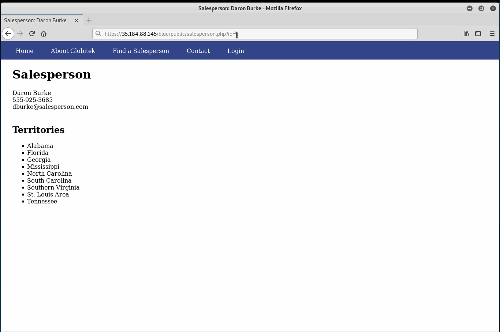
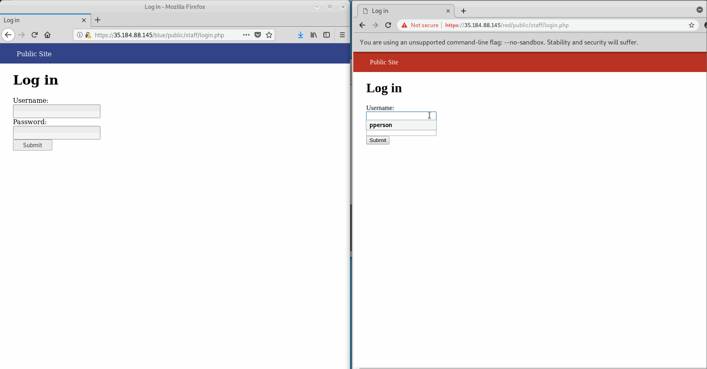
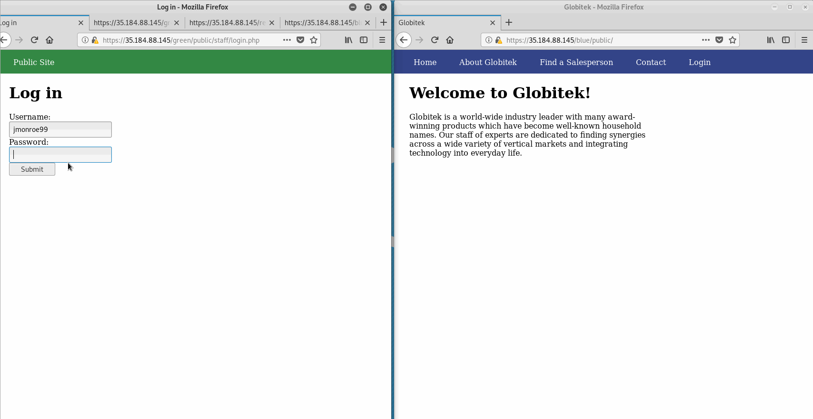
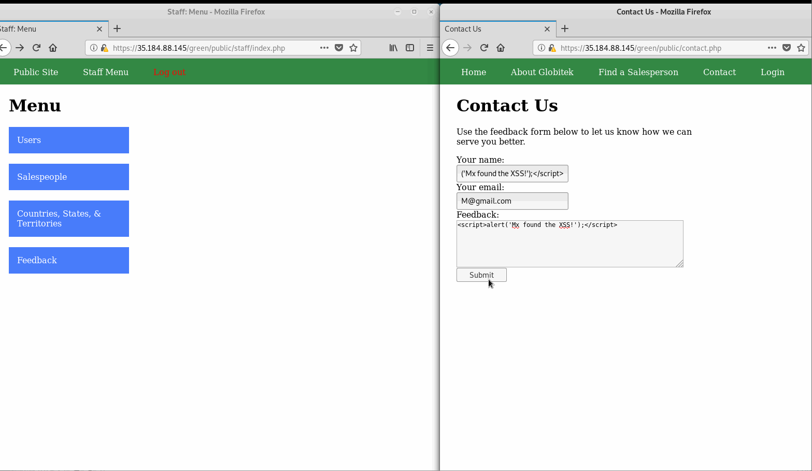
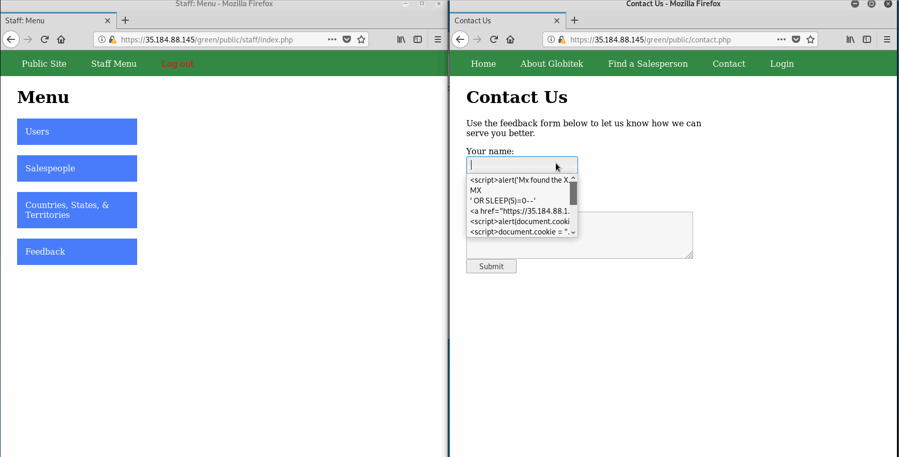
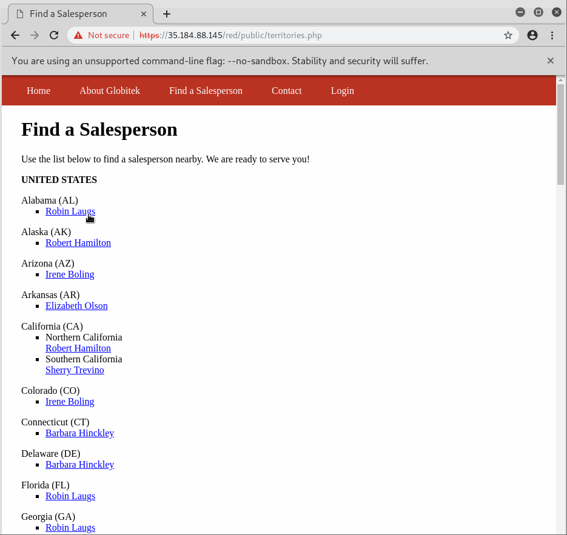
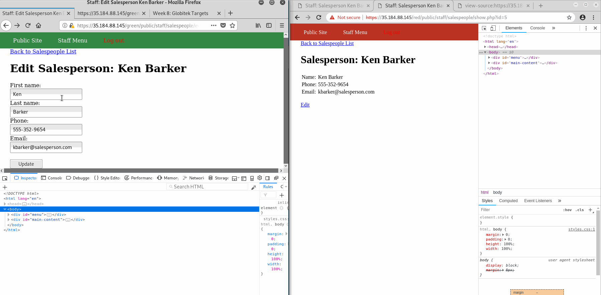

# Project 8 - Pentesting Live Targets

Time spent: 4 hours spent in total

> Objective: Identify vulnerabilities in three different versions of the Globitek website: blue, green, and red.

The six possible exploits are:
* Username Enumeration
* Insecure Direct Object Reference (IDOR)
* SQL Injection (SQLi)
* Cross-Site Scripting (XSS)
* Cross-Site Request Forgery (CSRF)
* Session Hijacking/Fixation

Each version of the site has been given two of the six vulnerabilities. (In other words, all six of the exploits should be assignable to one of the sites.)

## Blue

Vulnerability #1: SQL injection
  - SQL injection is found under the find salesperson page with any salesperson selected. Then with       
  https://35.184.88.145/blue/public/salesperson.php?id=1, the id number can be injected with ' OR SLEEP(5)=0--' etc.
  - Gif Walkthrough:

Vulnerability #2: Session Hijacking/Fixation
  - By using the old session ID from previous login user, the attacker is able to login as authenticated user without password.
  - Gif Walkthrough:

## Green

Vulnerability #1: Username Enumeration
  - When the username is correct, the error message is bold. Otherwise, it's plain.
  - In view page source for green target, when the username is incorrect, the class is failed. If username is correct, the class is failure. But for other two targets, the class is always same which is failure no matter the username is correct or not.
  - Gif Walkthrough: 

Vulnerability #2: Cross-Site Scripting (XSS)
  - XSS can be injected in contact page when sending feedback. When admin checks the feedback, the stored XSS is activated.
  - Gif Walkthrough:
  
Vulnerability #3: Bonus XSS
  - "" to set cookie
  - "" to read cookie
  - "<a href="https://Youtube.com/">Click to Download</a>" directs user to new url after clicking on the link
  - Gif Walkthrough: 

## Red

Vulnerability #1: Insecure Direct Object Reference (IDOR)
  - On salesperson page, when session id is changed to 10 or 11, the page will be directed to two salesperson who are not on the list.
  - Gif Walkthrough: 

Vulnerability #2: Cross-Site Request Forgery (CSRF)
  - When CSRF token value of green target is changed, the update of edited staff information returns invalid request error message. When    that of the red  target is changed, the update is successful.
  - Gif Walkthrough: 

## Notes

Describe any challenges encountered while doing the work
